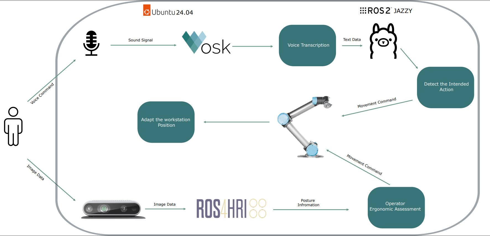
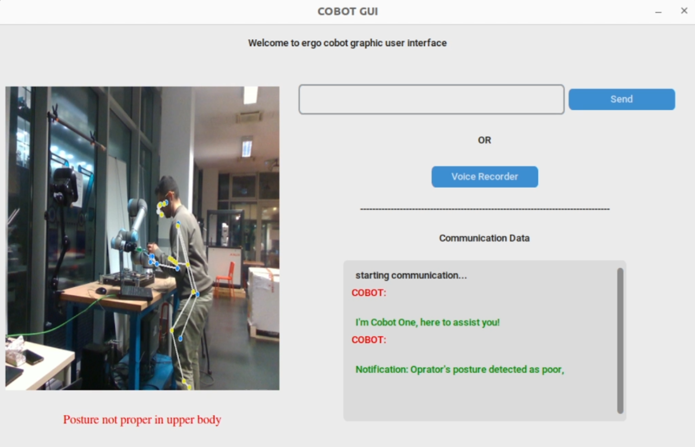

<p align="center">
  <a href="https://www.industry40lab.org/"></a>
  <a href="https://arise-middleware.eu/"></a>
</p>

<h1 style="display: flex; align-items: center; justify-content: space-between;">
    ErgoBot_AI: LLM-Enhanced Human-Robot Interaction for Optimized Ergonomic Posture
</h1>


## Description:

<p align="center">
  
</p>

This project is the second use case of <a href="https://arise-middleware.eu/">ARISE</a> project, This work consists of two modules (i) the ergonomics assessment of operator using the ROS4HRI capable of 3D pose estimation of the human body, (ii) the speech command to the robot using LLM. The modules are described in the following.

<ul>
  <li>Moveit2 based UR5e controller interface</li>
  <li>LLM (Ollama) ROS2 implementation for intent classification</li>
  <li>Voice Transcriber based on (VOSK)</li>
  <li>Active human posture tracker</li>
  <li>Graphical User Interface to communicate with operator</li>
</ul>

In summary, for the first scale-up of the ARISE project in this work, the LLM model has been implemented in the ROS2 framework to facilitate human/robot interaction. The operator sends a vocal command to the robot through a microphone, then the speech signal is transcribed using the VOSK API. Consequently, the transcribed command is forwarded to the Ollama 3.2 model through a ROS2 topic for the identification of the operator’s intention(s). As a result, the intention(s) is translated to low-level robot commands for the trajectory planning via MoveIt2. 

<hr>

#### UR5e Moveit2 controller

You can find the code related to this module in the package of <a href="https://github.com/Industry40Lab/ErgoBot_AI/tree/main/arm_controller">arm_controller</a>, where you can see the c++ moveit2 interface associated with moving the universal robot (UR5e in our case) in ROS2. In this package, the <a href="https://github.com/Industry40Lab/ErgoBot_AI/blob/main/arm_controller/src/holding_controller.cpp">file</a> contains the interface and in this code, the topics intended to move the robot is analysed and the needed movement will be executed. 


<hr>

#### LLM implementation in ROS2

In this project, the LLM implemented to classify the operator intent and to ease the communication between the oprator and the robot. The package related to this task is the <a href="https://github.com/Industry40Lab/ErgoBot_AI/tree/main/llm_communicator">**llm_communicator**</a>. To implement this part of the project we used, we used <a href="https://github.com/ollama/ollama/tree/main
">**OLLAMA3.2**</a> model.<br> 

This package has two main objectives:

<ol>
  <li>Notifing the oprator in the case of any notification is needed to communicate to the oprator, such as adjusting the posture.</li>
  <li>classifying the intended action of the oprator for robot movement.</li>
</ol>

For the second objective the LLM need to classify the user intent from the list of provided possible intent at the package in the _resource
/robot_commands.txt_. These intents are considered as the system prompt to the LLM model. 

<hr>

#### Voice Transcriber

To communicate efficiently with the robot or more especificly with the LLM model of the robot, a voice transcriber is implemented using the <a href="https://github.com/alphacep/vosk-api
">**VOSK API**</a>. Therefore in the package <a href="https://github.com/Industry40Lab/ErgoBot_AI/tree/main/voice_command/voice_command
">**voice_command**</a>, you can find the related code. 

<hr>

#### Human posture tracker

To assess the user posture, currently we used Mediapipe, and the assessment we used is the ‘’ Rapid Upper Limb Assessment (RULA)” which evaluates the exposure of individual workers to ergonomic risk factors associated with upper extremity musculoskeletal disorders (MSD). The RULA considers biomechanical and postural load requirements of the task on the neck, trunk and upper extremities. The package <a href="https://github.com/Industry40Lab/ErgoBot_AI/tree/main/rula_assessment
">**rula_assessment**</a> containes all the information related to this task. 

<hr>

### GUI

The graphical user interface implemented to improve the communication between oprator and the robot at the package <a href="https://github.com/Industry40Lab/ErgoBot_AI/tree/main/ergo_gui
">**ergo_gui**</a>.

<p align="center">
  
</p>

<hr>

# Curent Status and Planes

The work is still in development, we are working to develope the following changes:

| Packages | Curent Status | Planes |
| ------------------------------------------ |  ------------------------------------------------------------------------------------------------------------------------------------------------ | ------------------------------------------------------------- | 
|  <a href="https://github.com/Industry40Lab/ErgoBot_AI/tree/main/rula_assessment">**rula_assessment**</a> | Currently we are using <a href="https://ai.google.dev/edge/mediapipe/solutions/vision/pose_landmarker">**Mediapipe**</a> | We are working on development of <a href="https://github.com/ros4hri">**ROS4HRI**</a> |
| <a href="https://github.com/Industry40Lab/ErgoBot_AI/tree/main/llm_communicator">**llm_communicator**</a> | The current model works with self-implemented <a href="https://github.com/ollama/ollama/tree/main">**OLLAMA3.2**</a> | Implementation of rpk from PAL robotics|

<hr>

# Run 

please in order to run the code, run the following commands in terminal according to the following order:

Run this to run camera and GUI
```bash
ros2 run ergo_gui ergo_gui
```
Run to run llm by running this the sending command bottun will become active 
```bash
ros2 run llm_communicator cobot_llm
```
Run to activate voice command, please wait for complete loading, and remember to set the vosk model path in the code and then build the related package.
```bash
ros2 run voice_command voice_command_system
```
Run the following commands one by one to start the moveit ur5 controllers
```bash
ros2 launch ur_robot_driver ur_control.launch.py ur_type:=ur5e robot_ip:=192.168.0.100 launch_rviz:=false
```
```bash
ros2 launch ur_moveit_config ur_moveit.launch.py ur_type:="ur5e" launch_rviz:=false
```
 After activating the moveit for ur5 use the following code to activate the arm cotroll by llm model
```bash
ros2 launch arm_controller arm_handler.launch.py ur_type:="ur5e"
```


