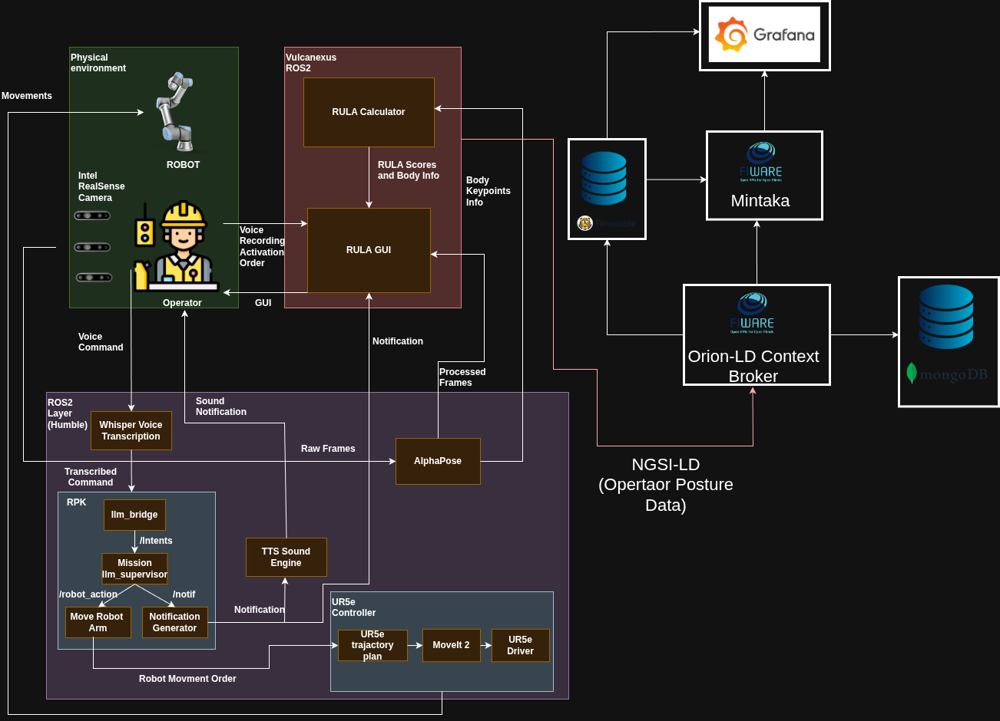
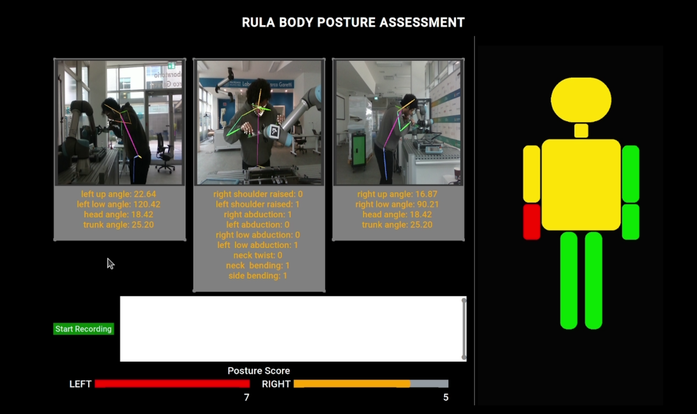

<p align="center">
  <a href="https://www.industry40lab.org/"></a>
  <a href="https://arise-middleware.eu/"></a>
</p>

<h1 style="display: flex; align-items: center; justify-content: space-between;">
    ErgoBot_AI: LLM-Enhanced Human-Robot Interaction for Optimized Ergonomic Posture
</h1>

<a href="https://ubuntu.com/blog/tag/ubuntu-24-04-lts"></a>
<a href="https://www.python.org/downloads/release/python-3100/"></a>
<a href="https://docs.ros.org/en/humble/index.html"></a>
<a href="https://docs.ros.org/en/rolling/Releases/Release-Jazzy-Jalisco.html"></a>

# Description:

<p align="center">
  
</p>

This project is the second use case of the <a href="https://arise-middleware.eu/">ARISE</a> project. The system integrates three primary functionalities: operator posture assessment, LLM-based human-robot interaction, and data recording/visualization. It uses three cameras (Intel RealSense) to monitor the operator, extracts body landmarks using AlphaPose from three angles(Front, Left, and Right), calculates the Rapid Upper Limb Assessment (RULA) score, and presents this information along with camera feeds to the operator via a Graphical User Interface (GUI). The GUI also enables voice command input, which is transcribed by the Whisper model, processed by an LLM (Llama3) within the RPK framework, and then used to control a UR5e robot via MoveIt2. RULA data is communicated via NGSI-LD to Arise middleware for historical data recording and visualization in Grafana.

<hr>

# ARISE Robot Skills

This system in current stage adapted 3 main set of skills from skills planed to be developed in <a href="https://arise-middleware.eu/">ARISE</a> Project, defining and categorized as follow:

## 1. Suitable Human Ergonomic Identification Skill 
This skill is responsible for **real-time monitoring and assessment of the operator's posture** to ensure ergonomic compliance.

* **AlphaPose Model:** Extracts and tracks **2D body landmarks** from camera feeds.
* **RULA Calculator:** Calculates the **Rapid Upper Limb Assessment (RULA) score** based on the extracted landmarks, quantifying the ergonomic risk.
* **GUI:** Presents the **RULA score**, **body landmark visualization**, and camera feeds to the operator, providing immediate feedback.

## 2. LLM Connector Skill 
This skill enables **natural language understanding and interaction** by converting spoken commands into executable robot instructions via an LLM agent.

* **Voice Transcriber (Whisper Model):** Converts the operator's **voice commands into text**.
* **LLM (Llama3) in RPK Framework:** Processes the transcribed text, understands the operator's intent, and generates appropriate robot commands.

## 3. Moving Robot Arm Skill 
This skill manages the **safe and effective physical movement of the UR5e collaborative robot arm**.

* **MoveIt2:** Handles **motion planning**, **inverse kinematics**, and **collision checking** to generate safe trajectories.
* **UR5e Driver and Controller:** Interfaces with the **UR5e robot** to execute the calculated movement trajectories.

<hr>

# Core Components

## Operator Monitoring and RULA Calculation (Supports Ergonomic Identification Skill) 

*  **<a href="/Ros_src/point_2D_extractor/point_2D_extractor/point_2D.py">AlphaPose Model:</a>** This model is responsible for extracting and tracking **2D body landmarks** of the operator from the camera feeds. Please follow the instruction to install the Alphapose from its <a href="https://github.com/MVIG-SJTU/AlphaPose">**official website**</a>.
*  **<a href="/alphapose/Utils/webcam_detector.py">Cameras:</a>** Three **Intel RealSense cameras** are used to capture the operator's movements and posture from different angles. To setup the use of **AlphaPose** in **ROS2** with **Intel RealSense**, please replace `./alphapose/detector/yolox_api.py` with the installed AlphaPose `yolox_api.py` in the detector folder, and also replace the content in `alphapose/utils` with equivalent files in the installed AlphaPose utils.

*  **<a href="/ergobot_poc/build/ros2/rula_calculator/rula_calculator/rula_calculator.py">RULA Calculator:</a>** This component calculates the **Rapid Upper Limb Assessment (RULA) score** based on the extracted body landmarks. This calculation is performed within the **Vulcanexus Docker environment**. 
*  **<a href="/ergobot_poc/build/ros2/rula_gui/rula_gui/rulaGui.py">GUI:</a>** This component is responsible for indicating the **camera feeds**, **LLM output**, activating the **voice command**, and indicating the **RULA and operator's body information output**. This component also runs within the **Vulcanexus Docker environment**.
* **<a href="/ergobot_poc/conf/orionld/config-dds.json">NGSI-LD Communication:</a>** RULA information from the RULA Calculator is communicated using the **NGSI-LD standard**. This allows the data to be recorded by the **Arise middleware**.

## Operator Interface (GUI) (Supports Ergonomic Identification Skill) 
  

The GUI provides the operator with real-time feedback and control. It is implemented within a Vulcanexus Docker environment.
*  **<a href="/ergobot_poc/build/ros2/rula_gui/rula_gui/rulaGui.py">Visual Feedback:</a>** Displays live camera feeds, visual representations of the extracted **body landmarks**, and the calculated **RULA score**.
*  **<a href="https://github.com/Industry40Lab/ErgoBot_AI/blob/M_24/ergobot_poc/build/ros2/rula_gui/rula_gui/rulaGui.py#L274">Command Input:</a>** **Voice command activation button**, which sends activation of transcribed voice commands for the LLM processing.
*  **<a href="/Ros_src/tts_system/tts_system/tts_engine.py">Audio Feedback:</a>** **Vocal output** from the LLM is provided via a **<a href="/Ros_src/tts_system/tts_system/tts_engine.py">Text-to-Speech (TTS) sound engine</a>**.

## Robot Control (Supports LLM Connector and Moving Robot Arm Skills) 

*   **<a href="/Ros_src/arise_rpk/">LLM (Llama3) in RPK Framework:</a>** This **large language model** processes the operator's transcribed voice commands, understands their intent, and generates appropriate robot commands. This operates within the **RPK framework**.
*  **<a href="/Ros_src/voice_transcriber/voice_transcriber/voice_transcriber.py">Voice Transcriber (Whisper Model):</a>** This component transcribes the operator's **voice commands into text**, which are then sent to the LLM.
*  **<a href="/Ros_src/ur_controler/">MoveIt2:</a>** A robotic manipulation platform used for **motion planning**, **inverse kinematics**, and **collision checking**. It receives commands from the LLM and calculates trajectories for the **UR5e robot**.
*  **<a href="/Ros_src/ur_controler/">UR5e Driver:</a>** Interfaces with the **UR5e robot**, receiving trajectories from MoveIt2 and executing the movements.

## 📊 Data Management and Visualization

* **Arise Middleware:** Records the **RULA information** communicated via **NGSI-LD**, providing **historical data storage**.
* **<a href="/ergobot_poc/conf/grafana/dashboards/Rula Information-1760105669922.json">Grafana Dashboard:</a>** Visualizes the **historical RULA data**, allowing for **analysis and monitoring** of operator posture over time.
##  Project Evolution
---

| Previous State | Current State |
| :--- | :--- |
| **ROS4HRI** (**Mediapipe** pose landmark detection) to retrieve operator's body joints | Benchmarking Human Pose Estimation (HPE) models; selection and integration of **AlphaPose HPE** |
| Development of ROS2 nodes for voice transcription using **VOSK api** | Development of ROS2 nodes for voice transcription using **WHISPER model** |
| Development of customized LLM interpreter (**LlAMA 3.2**) for commands execution by robot | Integration of **LLM** using '**rpk**' |
| Upgrading the device drivers to operate on **ROS2** (Cobots, cameras, end-effector) | Migration from ROS2 Humble to **Vulcanexus-Jazzy** |
| *Implicit Goal:* Establishment of a dedicated use case for postural monitoring and collaborative robot ensuring comfort/decision making | Implementation of **Rapid Upper Limb Assessment (RULA)** to score the operator's posture (Inclusion of **ergonomic assessment metrics** to precisely score the posture) |
| | Development of an intuitive **Graphical User Interface (GUI)** displaying **RULA score** and the communication of the robot and the operator |
| | Integration of **ARISE PoC**: interoperability between DDS and NGSI\_LD protocols to create a historical posture report displayed on **Grafana Dashboard** |
<hr>

# Run Instructions

To run the code, execute the following commands in sequence:

### Step 1: Running the ARISE PoC, GUI and RULA Calculator
Please run the follwing code in the <a href="./ergobot_poc/">ergobot_poc</a>.
```bash
xhost local:root
docker compose up --build -d --remove-orphans
```
#### Step 1.1: GUI running
In a new treminal:
```bash
 docker exec -ti ros2 bash
 source install/setup.bash
export ROS_DOMAIN_ID=0
ros2 run rula_gui rulaGui
```
#### Step 1.2: Rula Calculator
```bash
 docker exec -ti ros2 bash
 source install/setup.bash
export ROS_DOMAIN_ID=0
ros2 run rula_calculator rula_calculator
```

### Step 2: Running the ARISE PoC, GUI and RULA Calculator
Using the following code the three Intel Realsense camera's will be activated and using alphapose the body landmarks will be extracted.

Please take to account that the camera can take up to three sides with int codes, where 1 represent right, 0 represent front, and 2 represent left, and acoordingly for each side there must be a camera divice number in --device_name argument.
```bash
export ROS_DOMAIN_ID=0
ros2 run point_2D_extractor point_2D --active_sides [ACTIVE CAMERA SIDES] --device_name [SIDE DEVICES LIST] 
```

### Step 3: Start the LLM communicator
```bash
export ROS_DOMAIN_ID=0
ros2 launch ur5e_llm_controller ur5e_llm_controller.launch.py
```

### Step 4: Activate the voice command system (Whisper)

```bash
export ROS_DOMAIN_ID=0
ros2 run voice_transcriber voice_transcriber
```

### Step 5: Text To Sound Engine
```bash
export ROS_DOMAIN_ID=0
ros2 run tts_system tts_engine 
```


### Step 6: Start the MoveIt Config, and UR5e controllers
Run these commands one by one:

```bash
export ROS_DOMAIN_ID=0
ros2 launch ur_robot_driver ur_control.launch.py ur_type:=ur5e robot_ip:=192.168.0.100 launch_rviz:=false
```

```bash
export ROS_DOMAIN_ID=0
ros2 launch ur_moveit_config ur_moveit.launch.py ur_type:="ur5e" launch_rviz:=false
```

```bash
export ROS_DOMAIN_ID=0
ros2 launch arm_controller arm_handler.launch.py ur_type:="ur5e"
```


## ⚠️ ATTENTION ⚠️

A more complete documentation is under construction in the <a href="https://docs.google.com/document/d/15uTBWqZG-rkQXR-pJJdqV1uS9FHsHHZ_Mh6oYhIqCdw/edit?usp=sharing">following document</a>.
